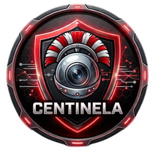

<p align="center">
  
</p>

<h1 align="center">Centinela</h1>

<p align="center">
  <strong>Visor de cámaras IP para Windows, rápido, local y sin nube.</strong><br>
  TP-Link Tapo · Imou · cualquier cámara RTSP/ONVIF
</p>

<p align="center">
  
  
  <a href="https://github.com/tecxion/centinela/releases"></a>
  <a href="LICENSE"></a>
</p>

---

Centinela muestra tus cámaras de vigilancia en una sola ventana, con el **mínimo retraso posible** y **sin pasar
por la nube**: la imagen va directamente de la cámara a tu PC por tu red local. Graba, hace capturas, detecta
movimiento, avisa cuando algo pasa y se queda vigilando en la bandeja del sistema.

## Índice

- [Características](#características)
- [Requisitos](#requisitos)
- [Instalación paso a paso](#instalación-paso-a-paso)
- [Preparar las cámaras](#preparar-las-cámaras)
- [Primeros pasos](#primeros-pasos)
- [Guía de uso](#guía-de-uso)
- [Cámaras con mala conexión (wifi lejana)](#cámaras-con-mala-conexión-wifi-lejana)
- [Atajos](#atajos)
- [Dónde se guardan tus datos](#dónde-se-guardan-tus-datos)
- [Privacidad y seguridad](#privacidad-y-seguridad)
- [Solución de problemas](#solución-de-problemas)
- [Actualizar y desinstalar](#actualizar-y-desinstalar)
- [Para desarrolladores](#para-desarrolladores)
- [Soporte y licencia](#soporte-y-licencia)

## Características

| | |
|---|---|
| 🎥 **Imagen en directo** | Latencia mínima (FFmpeg sin búfer y decodificación por GPU). Tapo, Imou y cualquier cámara RTSP. |
| 🔍 **Búsqueda automática** | Encuentra las cámaras de tu red por ONVIF; o añádelas a mano. |
| 🧩 **Vistas** | Cuadrícula (Auto, 1, 4, 9, 16), *Principal + miniaturas* (derecha o izquierda) y *Dos principales + miniaturas*. |
| ⏺ **Grabación y capturas** | Grabación MKV sin recodificar (una o todas a la vez) y capturas PNG a resolución completa. |
| 👁 **Detección de movimiento** | Por cámara, con marco rojo, aviso junto al reloj, registro, sensibilidad y horas de silencio. |
| 🔊 **Sonido** | Escucha una cámara a la vez, con silencio de un clic. |
| 🔎 **Zoom digital** | Rueda del ratón hasta 8×, arrastrar para moverse. |
| 📶 **Cámaras con wifi pobre** | Cambio HD/SD, ajuste de resolución, fps y bitrate de la propia cámara y modo *Suavizar imagen*. |
| 🛡️ **Privado** | Sin cuentas ni nube. Contraseñas cifradas con Windows. |
| 🔔 **Bandeja del sistema** | Sigue vigilando y grabando con la ventana cerrada; puede arrancar con Windows. |

## Requisitos

- **Windows 10 u 11** de 64 bits.
- **Git** para descargar el código.
- **.NET 10 SDK** para compilar y ejecutar Centinela.
- Unos **300 MB** libres (código, FFmpeg y compilación) y conexión a Internet para la instalación.
- Cámaras IP en la **misma red** que el PC, con RTSP activado (ver [Preparar las cámaras](#preparar-las-cámaras)).

## Instalación paso a paso

Todos los comandos se escriben en **PowerShell** (pulsa <kbd>Inicio</kbd>, escribe `PowerShell` y ábrelo).
Copia cada bloque, pégalo con clic derecho y pulsa <kbd>Intro</kbd>.

### 1. Instala Git y .NET 10

```powershell
winget install --id Git.Git -e
winget install --id Microsoft.DotNet.SDK.10 -e
```

Cierra PowerShell y ábrelo de nuevo para que reconozca los programas recién instalados. Puedes comprobarlo con:

```powershell
git --version
dotnet --version
```

> Si `winget` no existe en tu equipo, descarga los instaladores de [git-scm.com](https://git-scm.com/download/win)
> y de [dotnet.microsoft.com](https://dotnet.microsoft.com/download/dotnet/10.0) (elige **SDK x64**).

### 2. Descarga Centinela

```powershell
cd $HOME\Documents
git clone https://github.com/tecxion/centinela.git
cd centinela
```

### 3. Descarga FFmpeg

Centinela usa [FFmpeg](https://ffmpeg.org) (licencia LGPL) para recibir y mostrar el vídeo. Este script descarga
la versión adecuada (unos 80 MB) en la carpeta `ffmpeg\` del proyecto:

```powershell
powershell -ExecutionPolicy Bypass -File tools\get-ffmpeg.ps1
```

### 4. Pruébalo

```powershell
dotnet run --project src\Centinela.App -c Release
```

La primera vez tarda un poco porque compila. Si se abre la ventana de Centinela, todo está bien.

### 5. Instálalo como un programa normal (recomendado)

Así tendrás un `Centinela.exe` que puedes abrir sin PowerShell:

```powershell
dotnet publish src\Centinela.App -c Release -r win-x64 --self-contained false -o "$env:LOCALAPPDATA\Programs\Centinela"
explorer "$env:LOCALAPPDATA\Programs\Centinela"
```

En la carpeta que se abre, haz clic derecho sobre **Centinela.exe** › *Mostrar más opciones* › *Enviar a* ›
*Escritorio (crear acceso directo)*. Desde el acceso directo también puedes anclarlo a Inicio o a la barra de tareas.

> Ese `Centinela.exe` necesita .NET 10 en el equipo. Si lo copias a otro PC donde no hayas instalado el SDK,
> instala allí el runtime de escritorio: `winget install --id Microsoft.DotNet.DesktopRuntime.10 -e`.

## Preparar las cámaras

Centinela se conecta a las cámaras por **RTSP** (el vídeo) y **ONVIF** (búsqueda y ajustes). Cada marca lo
activa de una forma:

| Marca | Qué hacer | Usuario y contraseña en Centinela |
|---|---|---|
| **TP-Link Tapo** | App Tapo › la cámara › ⚙️ › *Ajustes avanzados* › **Cuenta de la cámara**: crea un usuario y contraseña. | Los de esa cuenta (no los de tu cuenta TP-Link). |
| **Imou** | En algunos modelos hay que activar RTSP/ONVIF en la app Imou. | Usuario `admin`; contraseña = **código de seguridad** de la pegatina de la cámara. |
| **Otras** | Activa RTSP en su app o web y apunta la URL del flujo principal y el secundario. | Los que tenga configurados la cámara. |

Direcciones que usa Centinela (no hace falta escribirlas, las pone solo según la marca):

| Marca | Calidad alta (principal) | Calidad baja (secundario) |
|---|---|---|
| Tapo | `rtsp://IP:554/stream1` | `rtsp://IP:554/stream2` |
| Imou | `rtsp://IP:554/cam/realmonitor?channel=1&subtype=0` | `…&subtype=1` |

> **Consejo:** da a cada cámara una IP fija en tu router (reserva DHCP) para que no cambie de dirección.

## Primeros pasos

1. Pulsa **🔍 Buscar en red** para encontrar tus cámaras, o **➕ Añadir cámara** para escribir sus datos a mano
   (nombre, marca, IP, usuario y contraseña). Si las cámaras están en otra red que el PC, escríbela en
   *Buscar también en* (p. ej. `192.168.2.0/24`).
2. En la ventana de la cámara pulsa **Probar**: comprueba la calidad alta y la baja y te dice resolución, códec y
   si tiene audio, o qué falla («Contraseña incorrecta», «Sin conexión»…).
3. Guarda. La cámara aparece en la ventana principal.
4. Elige cómo verlas en **Vista** (cuadrícula, principal + miniaturas…).

## Guía de uso

### Ventana principal

- **Vista**: cuadrícula (Auto, 1, 4, 9 o 16) o una cámara grande con miniaturas. En *Principal + miniaturas*,
  un clic en una miniatura la pone en grande. En *Dos principales + miniaturas*, el clic sustituye a la grande que
  lleva más tiempo sin cambiar, y arrastrar una miniatura sobre una grande la pone ahí.
- **Arrastrar** una cámara sobre otra las cambia de sitio.
- **Doble clic**: pantalla completa en calidad alta (<kbd>Esc</kbd> para salir).
- **📁 Grabaciones** abre la carpeta de vídeos; **⏺ Grabar todas** / **⏹ Detener todas**.
- Barra inferior: estado de las cámaras, **Movimiento** (eventos sin ver) y **Registro** (errores).

### Botones de cada cámara

Aparecen al pasar el ratón: en las cámaras grandes, abajo en el centro; en las miniaturas, arriba a la derecha.

| Botón | Qué hace |
|---|---|
| **HD / SD** | *(solo cámaras grandes)* Cambia entre calidad alta y baja para esa cámara. Se recuerda. |
| 🔇 / 🔊 | *(solo cámaras grandes con audio)* Activa o silencia el sonido. Solo suena una cámara a la vez. |
| 👁 | Activa o desactiva la detección de movimiento de esa cámara. |
| 📷 | Captura PNG a resolución completa. |
| ⏺ | Empieza o detiene la grabación (un punto rojo junto al nombre indica que graba). |
| ✎ | Editar la cámara. |
| 🗑 | Eliminar la cámara. |

### Menú del clic derecho

Pantalla completa · Captura · Grabar · Editar… · **Duplicar…** (copia con los mismos datos) ·
**Calidad de la cámara…** · Detección de movimiento · **Suavizar imagen** · Restablecer zoom · Eliminar.

### Zoom digital

En las cámaras grandes y a pantalla completa: **rueda del ratón** para acercar (hasta 8×, hacia el puntero),
**arrastrar** para moverse y <kbd>0</kbd> (con el puntero encima) para volver a 1×.

### Detección de movimiento y avisos

- Actívala con el botón 👁 de cada cámara (viene apagada). Un 👁 tachado junto al nombre indica que está apagada.
- Mientras hay movimiento, la cámara muestra un **marco rojo**.
- Con la ventana minimizada o en la bandeja, aparece un aviso junto al reloj: *«Detección de movimiento: Nombre»*.
  Un clic en el aviso abre Centinela.
- **Movimiento** (barra inferior) abre el registro de eventos: hora, cámara, duración e intensidad.
- **Ver › Opciones de avisos…**: por cámara, la sensibilidad (Baja, Media, Alta), el tiempo mínimo entre avisos
  (30 s, 1, 5 o 15 min) y qué avisos quieres; además, los sonidos de Windows y unas **horas de silencio**
  (por ejemplo 23:00–07:00) en las que no suena ni avisa nada, aunque se sigue registrando.

### Grabaciones y capturas

- Las grabaciones se guardan en `Vídeos\Centinela\<cámara>\` en formato **MKV**, sin perder calidad. Ábrelas con
  [VLC](https://www.videolan.org) o con el reproductor de Windows.
- Las capturas van a `Imágenes\Centinela\`.

### Bandeja del sistema

- La **X** no cierra Centinela: la esconde junto al reloj y sigue grabando y vigilando.
  Para cerrarla del todo, clic derecho en su icono › **Salir** (o *Archivo › Salir*).
- En ese mismo menú está **Arrancar con Windows**: se inicia escondida en la bandeja al encender el PC.

### Copias de seguridad

- **Archivo › Exportar JSON…** guarda la lista de cámaras. Puedes proteger las contraseñas con una clave; sin
  clave se exporta sin contraseñas. **Importar JSON…** añade las nuevas y actualiza las existentes.
- Además, Centinela hace una **copia automática sin contraseñas** en `Documentos\Centinela\camaras-copia.json`
  cada vez que cambias algo (carpeta configurable en *Archivo › Carpeta de copia automática…*).
- Ejemplo de formato: [`docs/ejemplo-camaras.json`](docs/ejemplo-camaras.json).

### Estadísticas

**Ver › Mostrar estadísticas** muestra en cada cámara `fps · ms · GPU/CPU`. Los ms son lo que tarda el PC en
preparar cada imagen, **no** el retraso total desde la cámara (ese no se puede medir).

### Actualizaciones

Una vez al día, al arrancar, Centinela mira si hay una versión nueva en GitHub y te avisa. También puedes
comprobarlo en **Ayuda › Buscar actualizaciones…**. Nunca descarga nada sola: el botón abre la página de
GitHub. Para actualizar, sigue [Actualizar y desinstalar](#actualizar-y-desinstalar).

## Cámaras con mala conexión (wifi lejana)

Si una cámara va a tirones, casi siempre es porque su señal wifi no da para la cantidad de datos que envía.
Prueba en este orden:

1. **Botón HD/SD** en la cámara grande: pasa a la calidad baja, mucho más ligera.
2. **Clic derecho › Calidad de la cámara…**: muestra la resolución, los fps y el bitrate con los que emite la
   cámara y, si la cámara lo permite por ONVIF, deja cambiarlos.
   - **Recomendados (wifi pobre)** rellena valores ligeros (≈720p · 10 fps · 768 kbps en alta y ≈360p · 10 fps ·
     256 kbps en baja). No cambia nada hasta que pulses **Aplicar…** y confirmes.
   - El cambio se guarda en la propia cámara, así que también afecta a su app y a sus grabaciones en la nube.
   - **Valores originales** vuelve a rellenar los que tenía antes del primer cambio.
3. **Clic derecho › Suavizar imagen**: la imagen va 1–2 s por detrás, pero repartida a su ritmo, sin avances
   rápidos tras un corte. Un ⏱ junto al nombre indica que está activo.
4. Si nada de lo anterior basta, la solución es de red: acercar el router o poner un **repetidor wifi** (o cable).

## Atajos

| Atajo | Acción |
|---|---|
| <kbd>F11</kbd> | Ventana principal a pantalla completa (y volver) |
| <kbd>Esc</kbd> | Salir de pantalla completa |
| Doble clic en una cámara | Abrirla a pantalla completa en calidad alta |
| Rueda del ratón | Zoom en cámaras grandes y a pantalla completa |
| <kbd>0</kbd> | Quitar el zoom de la cámara bajo el puntero |
| Arrastrar | Reordenar cámaras (o moverse con zoom) |

## Dónde se guardan tus datos

| Qué | Dónde |
|---|---|
| Cámaras y sus opciones | `%AppData%\Centinela\cameras.json` (contraseñas cifradas; solo tu usuario de Windows puede leerlas) |
| Ajustes, sonidos y horas de silencio | `%AppData%\Centinela\settings.json` |
| Registros de errores y de movimiento | `%AppData%\Centinela\logs\` (se borran solos a los 14 días) |
| Copia automática | `Documentos\Centinela\camaras-copia.json` (o la carpeta que elijas) |
| Grabaciones | `Vídeos\Centinela\<cámara>\` |
| Capturas | `Imágenes\Centinela\` |

Para abrir `%AppData%`, pulsa <kbd>Win</kbd>+<kbd>R</kbd>, escribe `%AppData%\Centinela` y pulsa <kbd>Intro</kbd>.

## Privacidad y seguridad

- **Sin nube ni cuentas.** El vídeo va directamente de la cámara a tu PC.
- **Contraseñas cifradas** con la protección de datos de Windows (DPAPI). No aparecen en registros, avisos ni copias
  sin clave.
- Para la búsqueda y los ajustes de la cámara (ONVIF) solo se usa autenticación Digest: la contraseña no viaja en claro.
- La comprobación de actualizaciones solo envía a GitHub la versión de Centinela.

## Solución de problemas

<details>
<summary><strong>«Contraseña incorrecta» o «Usuario o contraseña incorrectos»</strong></summary>

- **Tapo:** usa la *Cuenta de la cámara* creada en la app Tapo, no el correo de tu cuenta TP-Link.
- **Imou:** usuario `admin` y el **código de seguridad** de la pegatina (distingue mayúsculas).
- Tras varios intentos fallidos algunas cámaras se bloquean unos minutos: espera y vuelve a probar.
</details>

<details>
<summary><strong>«Sin conexión · reintentando»</strong></summary>

- Comprueba que el PC y la cámara están en la misma red y que la IP no ha cambiado (mira la app de la cámara).
- Reserva una IP fija para la cámara en el router.
- Algunas Imou necesitan activar RTSP/ONVIF en su app.
</details>

<details>
<summary><strong>La búsqueda en red no encuentra una cámara</strong></summary>

- **¿Están las cámaras en otra red que el PC?** (por ejemplo, PC en `192.168.1.x` y cámaras en `192.168.2.x`,
  o una red de invitados o VLAN para cámaras). La búsqueda normal no cruza el router: escribe la red de las
  cámaras en **Buscar también en** (`192.168.2.0/24`, `192.168.2.*` o `192.168.2.1-50`) y pulsa *Buscar de
  nuevo*. Centinela rellena ese campo con las redes de las cámaras que ya tienes añadidas.
- Algunas cámaras no responden a la búsqueda ONVIF, sobre todo si está desactivada. Añádela con
  **➕ Añadir cámara** escribiendo su IP.
- Las cámaras que ya tienes aparecen igualmente, marcadas como *Ya añadida*.
</details>

<details>
<summary><strong>La imagen va a tirones</strong></summary>

Mira [Cámaras con mala conexión](#cámaras-con-mala-conexión-wifi-lejana). Activa *Ver › Mostrar estadísticas*:
si los fps saltan entre 0 y valores muy altos, es la wifi de esa cámara.
</details>

<details>
<summary><strong>No se oye nada</strong></summary>

- El botón 🔊 solo aparece en cámaras grandes o a pantalla completa y si la cámara envía audio (actívalo en su app).
- Todas empiezan en silencio; pulsa 🔇 para escuchar. El volumen se regula en el mezclador de Windows.
</details>

<details>
<summary><strong>«No se encuentran las DLLs de FFmpeg»</strong></summary>

Falta el paso 3 de la instalación. Ejecuta `powershell -ExecutionPolicy Bypass -File tools\get-ffmpeg.ps1`
y vuelve a compilar o publicar.
</details>

<details>
<summary><strong>PowerShell dice que la ejecución de scripts está deshabilitada</strong></summary>

Usa el comando tal cual aparece arriba, con `-ExecutionPolicy Bypass`: permite ese script sin cambiar la
configuración de tu equipo.
</details>

Si el problema sigue, abre **Registro** (barra inferior), pulsa *Copiar* y escríbenos (ver [Soporte](#soporte-y-licencia)).

## Actualizar y desinstalar

**Actualizar** (cierra antes Centinela con clic derecho en su icono de la bandeja › *Salir*):

```powershell
cd $HOME\Documents\centinela
git pull
dotnet publish src\Centinela.App -c Release -r win-x64 --self-contained false -o "$env:LOCALAPPDATA\Programs\Centinela"
```

Tus cámaras y ajustes se conservan.

**Desinstalar:**

1. En el menú de la bandeja, desactiva **Arrancar con Windows** y pulsa **Salir**.
2. Borra la carpeta `%LOCALAPPDATA%\Programs\Centinela` y la carpeta del código (`Documentos\centinela`).
3. Si quieres borrar también tus datos: `%AppData%\Centinela` (y, si quieres, las grabaciones y capturas).

## Para desarrolladores

### Estructura

```
src/
  Centinela.App/     Aplicación WPF (ventanas, vistas, bandeja)
  Centinela.Core/    Lógica sin dependencias: modelo, vistas, ONVIF, movimiento, copias, reproducción
  Centinela.Media/   FFmpeg: sesiones RTSP, decodificación, grabación, capturas, audio
tests/
  Centinela.Core.Tests/    Pruebas unitarias
  Centinela.Media.Tests/   Pruebas de integración con un servidor RTSP local
tools/               Scripts: FFmpeg, mediamtx, icono
docs/                Ejemplo de copia y documentos de diseño
```

Tecnologías: C# / .NET 10, WPF, [FFmpeg.AutoGen](https://github.com/Ruslan-B/FFmpeg.AutoGen) (FFmpeg 9.0 LGPL),
[NAudio](https://github.com/naudio/NAudio), xUnit.

### Pruebas

```powershell
dotnet test tests\Centinela.Core.Tests
powershell -ExecutionPolicy Bypass -File tools\get-mediamtx.ps1   # servidor RTSP para las pruebas de vídeo
dotnet test tests\Centinela.Media.Tests                            # necesita ffmpeg/ffprobe (con libx264) en el PATH
```

La aplicación (`src/Centinela.App`) no tiene pruebas automáticas. Para probarla sin cámaras reales usa dos
terminales:

```powershell
# Terminal 1: servidor RTSP
tools\bin\mediamtx.exe
```

```powershell
# Terminal 2: vídeo de prueba
ffmpeg -re -f lavfi -i testsrc=size=1280x720:rate=25 -c:v libx264 -pix_fmt yuv420p -tune zerolatency -f rtsp rtsp://127.0.0.1:8554/prueba
```

Después añade una cámara de marca **Otra (RTSP)** con la URL principal `rtsp://127.0.0.1:8554/prueba`
(en «Avanzado»).

### CENTINELA_DATA_DIR: probar sin tocar tu instalación

```powershell
$env:CENTINELA_DATA_DIR = "$env:TEMP\centinela-prueba"
dotnet run --project src\Centinela.App            # añade "-- --tray" para arrancar oculta en la bandeja
```

Con esta variable, todo lo que escribe Centinela (cámaras, ajustes, registros, `backup\`, `recordings\` y
`snapshots\`) queda en esa carpeta. Es una instancia aparte de la que tengas abierta, no toca el registro de
Windows («Arrancar con Windows» no aparece) y no busca actualizaciones al arrancar.

### Publicar una versión

1. Cambia `<Version>` en `Directory.Build.props` (p. ej. `1.3.0`).
2. Publica en GitHub (`tecxion/centinela`) una *release* con la etiqueta `vX.Y.Z` (los borradores y las
   *pre-releases* no cuentan). Las copias instaladas la verán en su siguiente comprobación.

### Icono

`src/Centinela.App/Assets/centinela.png` es el original. Tras cambiarlo, regenera el `.ico` (16–256 px):

```powershell
powershell -ExecutionPolicy Bypass -File tools\make-icon.ps1
```

### Si venías de CamaraWin

Centinela antes se llamaba CamaraWin. Al arrancar por primera vez copia `cameras.json` y `settings.json` de
`%AppData%\CamaraWin` (sin tocar la carpeta antigua), actualiza «Arrancar con Windows» e importa las copias JSON
de CamaraWin. Las grabaciones y capturas antiguas siguen en `Vídeos\CamaraWin` e `Imágenes\CamaraWin`.

## Soporte y licencia

- **Soporte:** [www.tecxart.es](https://www.tecxart.es) · [tecxart@gmail.com](mailto:tecxart@gmail.com) · en la
  aplicación, *Ayuda › Soporte*.
- **Errores y sugerencias:** [issues en GitHub](https://github.com/tecxion/centinela/issues).
- **Licencia:** [MIT](LICENSE). FFmpeg se distribuye bajo LGPL; ver [THIRD-PARTY-NOTICES.md](THIRD-PARTY-NOTICES.md).
